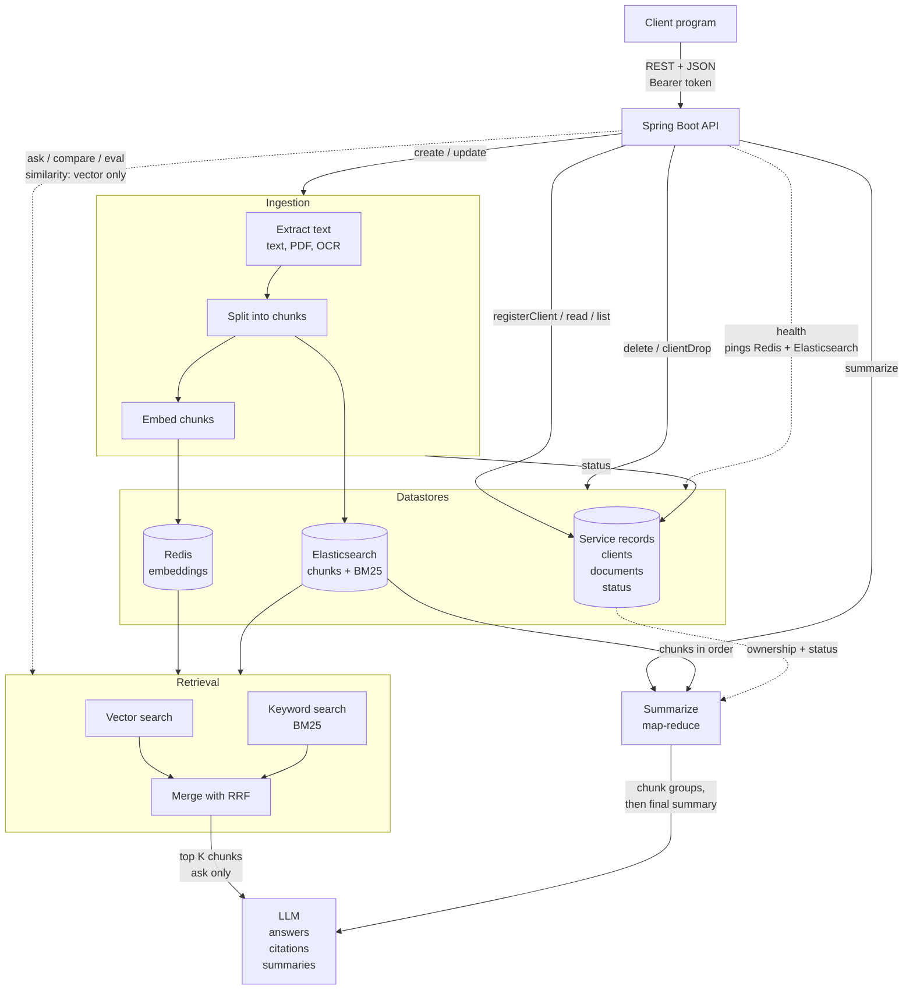

# KnowledgeDrop

KnowledgeDrop is a REST API that works like a drop box for knowledge. Client programs upload documents (PDF, text, images), and the service indexes them for semantic and keyword retrieval. It answers questions grounded in the stored documents with citations, summarizes documents, and finds similar documents. It also includes built-in tooling to compare and evaluate retrieval strategies.

## Why Hybrid Retrieval

Vector search is strong at meaning (for example, "How do I cancel?" matching a termination policy) but weak at exact terms such as error codes, IDs, and names. Keyword search (Elasticsearch BM25) is the opposite. KnowledgeDrop runs both and merges the result lists with Reciprocal Rank Fusion (RRF), which retrieves better than either method alone. The `compare` and `eval` endpoints measure that claim with real numbers.

## Architecture

- **Spring Boot:** REST endpoints, request validation, client authentication, and the service's own records of clients and documents (owner, name, type, upload time, status).
- **Redis:** stores chunk embeddings and serves vector similarity search.
- **Elasticsearch:** stores chunk text and metadata and serves keyword search.
- **LLM:** generates answers from retrieved context and produces summaries.
- **Scoping:** every query is filtered by client, so one client never sees another client's data.

All API traffic uses REST with JSON request and response bodies.

## Conventions

- **Authentication:** the client token returned by `registerClient` is sent as `Authorization: Bearer <token>` on every endpoint except `registerClient` and `health`. Invalid or missing tokens return HTTP 401.
- **Document status:** each document is `processing` (being ingested), `ready` (searchable), or `failed`. Search, `ask`, `similarity`, and `summarize` only use `ready` documents.
- **Ingestion pipeline:** `create` and `update` extract text (direct read for text files, text extraction for PDFs, OCR for images, keeping page numbers), split it into chunks, embed each chunk into Redis, and index each chunk in Elasticsearch.

## API Reference

### Client Registration

| Method | Endpoint | Inputs | Behavior |
|---|---|---|---|
| POST | `/knowledgeDrop/registerClient` | Client object (client name) | Creates a client with a new client ID and token. Returns both, or HTTP 409 if the name is already registered. |
| DELETE | `/knowledgeDrop/clientDrop` | Token, client ID | Verifies the token matches the client ID, then deletes all of the client's documents (files, Redis embeddings, Elasticsearch entries), the client record, and the token. |

### Document Management

| Method | Endpoint | Inputs | Behavior |
|---|---|---|---|
| POST | `/knowledgeDrop/create` | Token, document name, type (`pdf`, `text`, `image`), content | Stores the file, runs the ingestion pipeline, and returns the document ID and status. Errors on an unsupported type or empty content. |
| PUT | `/knowledgeDrop/update` | Token, document ID or name, new content | Deletes the document's existing chunks from Redis and Elasticsearch and re-ingests the new content. Keeps the same document ID and sets status to `processing`. |
| GET | `/knowledgeDrop/read` | Token, document ID or name | Returns the content, ID, filename, type, upload time, and status, or HTTP 404. |
| DELETE | `/knowledgeDrop/delete` | Token, document ID or name | Deletes the stored file, its Redis embeddings, its Elasticsearch entries, and the document record. |
| GET | `/knowledgeDrop/list` | Token, optional `status`, `limit`, `offset` | Returns the client's documents with ID, filename, type, upload time, and status. Returns an empty list if there are none. |

### Question Answering and Similarity

| Method | Endpoint | Inputs | Behavior |
|---|---|---|---|
| POST | `/knowledgeDrop/ask` | Token, question, optional `k` (default 5) | Runs hybrid retrieval (vector plus BM25, merged with RRF) over the client's `ready` documents, passes the top `k` chunks to an LLM, and returns the answer with citations (document ID, filename, page, snippet). Says so if nothing relevant is found. |
| POST | `/knowledgeDrop/similarity` | Token, text to compare, optional `k` (default 5) | Embeds the input, compares it with the client's stored chunk embeddings, and returns the top `k` documents with ID, filename, similarity score, and best-matching snippet. |

### Search Evaluation and Summarization

| Method | Endpoint | Inputs | Behavior |
|---|---|---|---|
| POST | `/knowledgeDrop/compare` | Token, query text, optional `k` (default 5) | Runs the query through vector, keyword, and hybrid (RRF) search. Returns the top `k` chunks per mode with document ID, filename, page, snippet, and score, plus an overlap summary. |
| POST | `/knowledgeDrop/eval` | Token, labeled question set, optional `k` (default 5) | Runs each question through all three modes and computes recall@k and MRR per mode, with a per-question rank breakdown. Errors if labels reference documents the client does not own. |
| POST | `/knowledgeDrop/summarize` | Token, document ID, optional `length` (`short` or `detailed`) | Verifies ownership and that the document is `ready`. For long documents, summarizes groups of chunks first, then combines them into a final summary (map-reduce). Returns summary text, document ID, and number of chunks used. |

### Service Health

| Method | Endpoint | Behavior |
|---|---|---|
| GET | `/knowledgeDrop/health` | No token required. Pings Elasticsearch and Redis. Returns HTTP 200 if both are reachable, 503 if either is down, with per-dependency status. |

## Example Client Programs

- **Insurance coverage lookup:** a program in a hospital's billing system that uploads plan documents and payer contracts with `create`, calls `ask` with coverage questions, and attaches the returned citations to the claim record. It uses `list` and `delete` to keep plan documents current.
- **Essay originality checker:** a program in a school's submission system that calls `similarity` on each submitted essay and flags the submission when the top score exceeds a threshold. It then calls `create` to add the accepted essay to the collection. It never calls `ask`.

## Tech Stack

- **Language and framework:** Java, Spring Boot
- **Datastores:** Redis (vectors), Elasticsearch (keyword search)
- **Data format:** JSON

## Development Tools

| Category | Tool |
|---|---|
| Continuous integration | GitHub Actions |
| Build and dependency manager | Maven (Maven Wrapper) |
| Unit testing | JUnit 5 (Spring Boot Starter Test), MockMvc |
| API testing over the network | Postman, curl |
| Mocking | Mockito (Spring Boot Starter Test) |
| Test coverage | JaCoCo |
| Style checker | Checkstyle |
| Static analysis | PMD |
| Project management | Jira Kanban board |
| IDE | Visual Studio Code |

## Team

- Daniel Krasner (dk3460)
- Patrick Salsbury (prs2153)
- Ishan Akhouri (ia2659)
