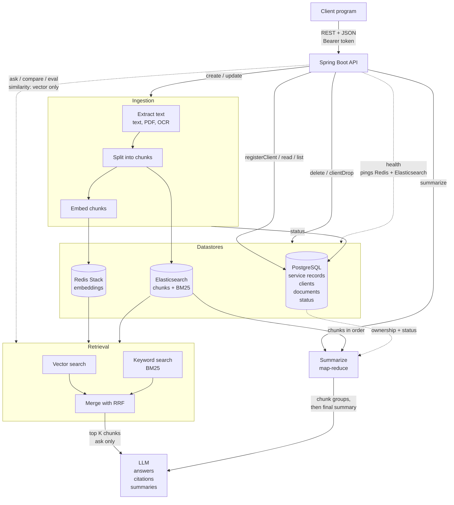

# KnowledgeDrop

KnowledgeDrop is a REST API that works like a drop box for knowledge. Client programs upload documents (PDF, text, images), and the service indexes them for semantic and keyword retrieval. It answers questions grounded in the stored documents with citations, summarizes documents, and finds similar documents. It also includes built-in tooling to compare and evaluate retrieval strategies.

## Why Hybrid Retrieval

Vector search is strong at meaning (for example, "How do I cancel?" matching a termination policy) but weak at exact terms such as error codes, IDs, and names. Keyword search (Elasticsearch BM25) is the opposite. KnowledgeDrop runs both and merges the result lists with Reciprocal Rank Fusion (RRF), which retrieves better than either method alone. The `compare` and `eval` endpoints measure that claim with real numbers.

## Architecture



- **Spring Boot:** REST endpoints, request validation, client authentication, and the service's own records of clients and documents.
- **PostgreSQL:** stores those records (owner, name, type, upload time, status) through JPA.
- **Redis Stack:** stores chunk embeddings and serves vector similarity search (the RediSearch module is required).
- **Elasticsearch:** stores chunk text and metadata and serves keyword search.
- **LLM:** generates answers from retrieved context and produces summaries.
- **Scoping:** every query is filtered by client, so one client never sees another client's data.

All API traffic uses REST with JSON request and response bodies.

## Conventions

- **Authentication:** the client token returned by `registerClient` is sent as `Authorization: Bearer <token>` on every endpoint except `registerClient` and `health`. Invalid or missing tokens return HTTP 401. Only a SHA-256 hash of the token is stored.
- **Document status:** each document is `processing` (being ingested), `ready` (searchable), or `failed`. Search, `ask`, `similarity`, and `summarize` only use `ready` documents.
- **Document names:** a document can be referenced by ID or by name, so names are unique per client. `create` returns HTTP 409 if the client already has a document with that name.
- **Ingestion pipeline:** `create` and `update` extract text (direct read for text files, text extraction for PDFs, OCR for images, keeping page numbers), split it into chunks, embed each chunk into Redis, and index each chunk in Elasticsearch. Ingestion runs in the background, so `create` and `update` return `202 Accepted` with status `processing`.
- **Errors:** always `{"error": "Not Found", "reason": "..."}`.

## API Reference

All paths are under `/knowledgeDrop`.

### Client Registration

| Method | Endpoint | Inputs | Behavior |
|---|---|---|---|
| POST | `/knowledgeDrop/registerClient` | Client object (client name) | Creates a client with a new client ID and token. Returns both, or HTTP 409 if the name is already registered. |
| DELETE | `/knowledgeDrop/clientDrop` | Token, client ID | Verifies the token matches the client ID, then deletes all of the client's documents (files, Redis embeddings, Elasticsearch entries), the client record, and the token. |

### Document Management

| Method | Endpoint | Inputs | Behavior |
|---|---|---|---|
| POST | `/knowledgeDrop/create` | Token, document name, type (`pdf`, `text`, `image`), content | Stores the file, runs the ingestion pipeline, and returns the document ID and status. Errors on an unsupported type, empty content, or a name the client already uses (409). |
| PUT | `/knowledgeDrop/update` | Token, document ID or name, new content | Deletes the document's existing chunks from Redis and Elasticsearch and re-ingests the new content. Keeps the same document ID and sets status to `processing`. |
| GET | `/knowledgeDrop/read` | Token, document ID or name | Returns the content, ID, filename, type, upload time, and status, or HTTP 404. |
| DELETE | `/knowledgeDrop/delete` | Token, document ID or name | Deletes the stored file, its Redis embeddings, its Elasticsearch entries, and the document record. |
| GET | `/knowledgeDrop/list` | Token, optional `status`, `limit`, `offset` | Returns the client's documents with ID, filename, type, upload time, and status. Returns an empty list if there are none. |

### Question Answering and Similarity

| Method | Endpoint | Inputs | Behavior |
|---|---|---|---|
| POST | `/knowledgeDrop/ask` | Token, question, optional `k` (default 5) | Runs hybrid retrieval (vector plus BM25, merged with RRF) over the client's `ready` documents, passes the top `k` chunks to an LLM, and returns the answer with citations (document ID, filename, page, snippet). Says so if nothing relevant is found. |
| POST | `/knowledgeDrop/similarity` | Token, text to compare, optional `k` (default 5) | Embeds the input, compares it with the client's stored chunk embeddings, and returns the top `k` documents with ID, filename, similarity score, and best-matching snippet. |

### Search Evaluation and Summarization

| Method | Endpoint | Inputs | Behavior |
|---|---|---|---|
| POST | `/knowledgeDrop/compare` | Token, query text, optional `k` (default 5) | Runs the query through vector, keyword, and hybrid (RRF) search. Returns the top `k` chunks per mode with document ID, filename, page, snippet, and score, plus an overlap summary. |
| POST | `/knowledgeDrop/eval` | Token, labeled question set, optional `k` (default 5) | Runs each question through all three modes and computes recall@k and MRR per mode, with a per-question rank breakdown. Errors if labels reference documents the client does not own. |
| POST | `/knowledgeDrop/summarize` | Token, document ID, optional `length` (`short` or `detailed`) | Verifies ownership and that the document is `ready`. For long documents, summarizes groups of chunks first, then combines them into a final summary (map-reduce). Returns summary text, document ID, and number of chunks used. |

### Service Health

| Method | Endpoint | Behavior |
|---|---|---|
| GET | `/knowledgeDrop/health` | No token required. Pings Elasticsearch and Redis. Returns HTTP 200 if both are reachable, 503 if either is down, with per-dependency status. |

## Example Client Programs

- **Insurance coverage lookup:** a program in a hospital's billing system that uploads plan documents and payer contracts with `create`, calls `ask` with coverage questions, and attaches the returned citations to the claim record. It uses `list` and `delete` to keep plan documents current.
- **Essay originality checker:** a program in a school's submission system that calls `similarity` on each submitted essay and flags the submission when the top score exceeds a threshold. It then calls `create` to add the accepted essay to the collection. It never calls `ask`.

## Tech Stack

- **Language and framework:** Java 17, Spring Boot
- **Datastores:** PostgreSQL (service records), Redis Stack (vectors), Elasticsearch (keyword search)
- **Local infrastructure:** Docker Compose
- **Data format:** JSON

## Local Development

Requires JDK 17+ and Docker Desktop. No Maven install needed; use the wrapper.

```bash
docker compose up -d     # PostgreSQL, Redis Stack, Elasticsearch
./mvnw verify            # compile, test, JaCoCo report, Checkstyle, PMD
./mvnw spring-boot:run   # start on http://localhost:8080
docker compose down      # stop the datastores (add -v to wipe their data)
```

Defaults match `src/main/resources/application.yml`. Override with `DB_URL`, `DB_USER`, `DB_PASSWORD`, `REDIS_HOST`, `REDIS_PORT`, and `ELASTICSEARCH_URIS`. **Tests do not need Docker**: they run against in-memory H2 (`application-test.yml`).

If `./mvnw` says permission denied, run `chmod +x mvnw`.

### Try it

```bash
curl -s -X POST localhost:8080/knowledgeDrop/registerClient \
  -H 'Content-Type: application/json' -d '{"clientName":"demo"}'
# => {"clientId":"...","clientToken":"..."}   (token is shown once)

TOKEN=<clientToken>
curl -s localhost:8080/knowledgeDrop/list -H "Authorization: Bearer $TOKEN"

# create: JSON metadata part + binary file part
curl -s -X POST localhost:8080/knowledgeDrop/create -H "Authorization: Bearer $TOKEN" \
  -F 'metadata={"name":"policy.pdf","type":"pdf"};type=application/json' \
  -F 'file=@policy.pdf;type=application/octet-stream'
```

`create` and `update` use `multipart/form-data`: a `metadata` JSON part (`{"name": "...", "type": "pdf|text|image"}`, optionally `"text"` for raw text) and a `file` part. `update` metadata uses `{"documentId": "..."}` or `{"documentName": "..."}`.

### Implementation status

Endpoint logic that is not built yet is marked `TODO(<endpoint>)` and returns `501 Not Implemented`. The AI-dependent items are **DEFERRED** until an LLM and embedding provider are chosen. Find every open item with `grep -rn "TODO(" src/main`. Matching disabled tests live in `EndpointTodoTests`; move each into a real test class as you build the endpoint.

| Endpoint | Status | Implement in |
|---|---|---|
| `POST registerClient` | **Built** (reference implementation) | `ClientService.register` |
| `POST create` | TODO(create) | `DocumentService.create` |
| `PUT update` | TODO(update) | `DocumentService.update` |
| `GET read` | TODO(read) | `DocumentService.read` |
| `DELETE delete` | TODO(delete) | `DocumentService.delete` |
| `GET list` | TODO(list) | `DocumentService.list` |
| `DELETE clientDrop` | TODO(clientDrop) | `ClientService.drop` |
| `GET health` | TODO(health) | `HealthService.check` |
| Ingestion pipeline (extract, chunk, keyword index) | TODO(ingestion) | `IngestionService` |
| `POST ask` | **DEFERRED** (LLM + embeddings) | `AskService.ask` |
| `POST similarity` | **DEFERRED** (embeddings) | `AskService.similarity` |
| `POST compare` | **DEFERRED** (embeddings) | `SearchService.compare` |
| `POST eval` | **DEFERRED** (embeddings) | `SearchService.eval` |
| `POST summarize` | **DEFERRED** (LLM) | `SummarizationService.summarize` |
| Chunk embeddings in Redis, RRF | **DEFERRED** | `IngestionService`, `retrieval/` package |

### Code layout

```
src/main/java/dev/coms4156/knowledgedrop/
  api/          controllers (wiring, params, status codes) + api/dto request/response records
  service/      business logic; stubs carry the TODOs
  retrieval/    VectorStore, KeywordIndex, EmbeddingClient, LlmClient, RrfMerger, RetrievalService
  model/        JPA entities (ClientRecord, DocumentRecord) and enums
  repository/   Spring Data JPA repositories (always scoped to the owning client)
  security/     AuthInterceptor (Bearer token -> client), TokenUtils (generate + SHA-256 hash)
  exception/    ApiException, ErrorResponse, GlobalExceptionHandler
  config/       WebConfig (auth on /knowledgeDrop/**), AsyncConfig, KnowledgeDropProperties
```

Adding an endpoint: fill in the service method (the controller, DTOs, auth, and error handling are already wired). `ClientService.register` plus `ClientServiceTest` and `ApiAuthIntegrationTest` show the pattern.

## Development Tools

| Category | Tool |
|---|---|
| Continuous integration | GitHub Actions (`.github/workflows/ci.yml`) |
| Build and dependency manager | Maven (Maven Wrapper) |
| Unit testing | JUnit 5 (Spring Boot Starter Test), MockMvc |
| API testing over the network | Postman, curl |
| Mocking | Mockito (Spring Boot Starter Test) |
| Test coverage | JaCoCo (`target/site/jacoco/index.html`) |
| Style checker | Checkstyle (Google Java Style) |
| Static analysis | PMD |
| Local infrastructure | Docker Compose |
| Project management | Jira Kanban board |
| IDE | Visual Studio Code |

Checkstyle, PMD, and the JaCoCo gate are non-blocking by default so the first CI run is not red. Once the team has a clean run, enforce them in `pom.xml` `<properties>`:

```xml
<quality.failOnViolation>true</quality.failOnViolation>
<quality.checkstyle.severity>warning</quality.checkstyle.severity>
<jacoco.line.coverage.min>0.80</jacoco.line.coverage.min>
```

## Design Assumptions

- Spring Boot 4.1 on Java 17; package `dev.coms4156.knowledgedrop`.
- Records (clients, documents) in PostgreSQL via JPA; `ddl-auto: update` for dev, so add Flyway (or similar) migrations before a real deployment. Original uploads go under `./data/files`.
- 501 stubs return the normal JSON error body so the API contract is testable before the logic.

## Team

- Daniel Krasner (dk3460)
- Patrick Salsbury (prs2153)
- Ishan Akhouri (ia2659)
